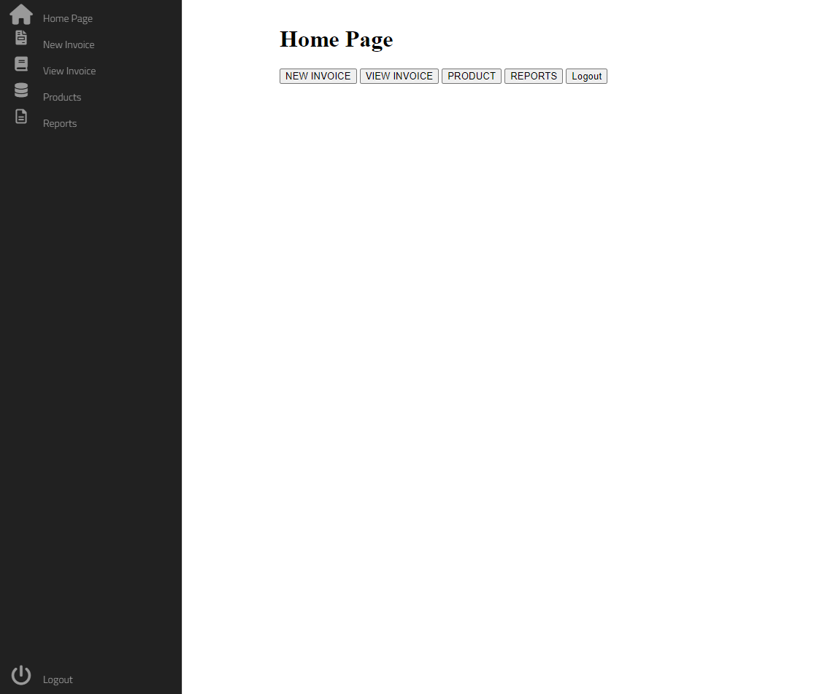
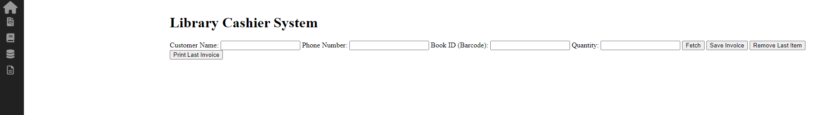
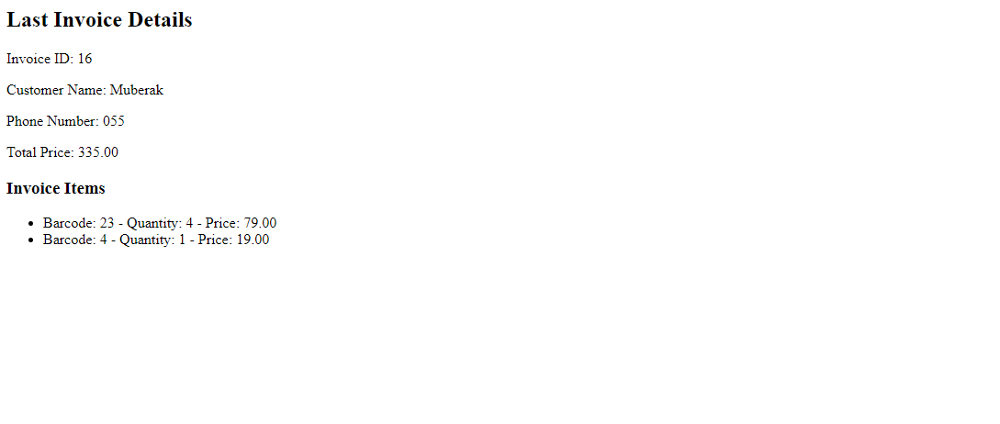
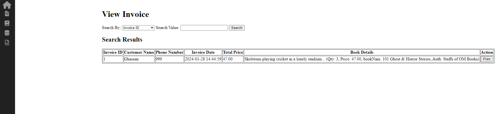
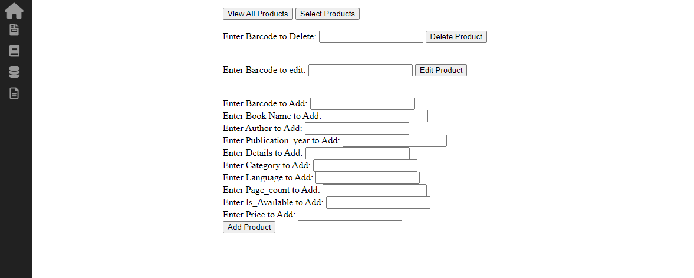
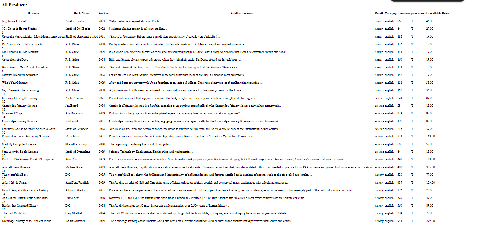
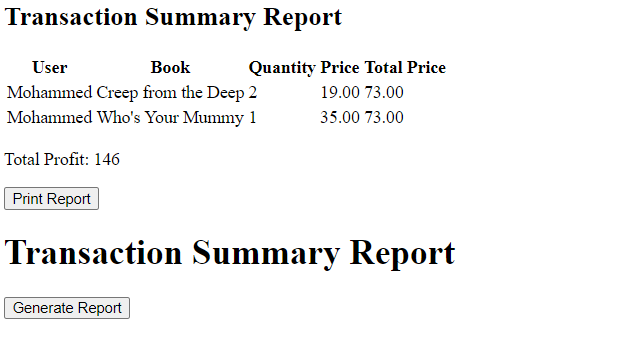

# Library Cashier System

This project is a Library Cashier System that allows for the management of book transactions, including the creation, viewing, and printing of invoices. The system includes various features such as adding, editing, and deleting products, user login, and report generation.

## Table of Contents

- [Features](#features)
- [Demo](#demo)
- [Team](#team)
- [Project Details](#project-details)
  - [Authentication](#authentication)
  - [Invoice Management](#invoice-management)
  - [Product Management](#product-management)
  - [Report Generation](#report-generation)
  - [Styling](#styling)
- [File Structure](#file-structure)
- [Prerequisites](#prerequisites)
- [Installation](#installation)
- [Usage](#usage)
- [Disclaimer](#disclaimer)
- [Screenshots](#screenshots)
- [Conclusion](#conclusion)

## Features

- **User Authentication**: Login and logout functionalities for secure access.
- **Invoice Management**: Create, view, and print invoices.
- **Product Management**: Add, edit, and delete books in the library.
- **Report Generation**: Generate and view transaction summary reports.

## Demo

You can watch a demo of this website on YouTube: [Demo Video](https://www.youtube.com/your-demo-video-url)

## Team

- **Team Leader:** Mohammed Aleshawi
- **Team Members:** Mohammed Aleshawi, Mbarak Aldosari, Abdulelah Alshrane, Ibrahim Alfadhel, Ghassan Alasmari

## Project Details

### Authentication

The system includes a secure login and logout functionality. Only authenticated users can access the features of the system. User sessions are managed using PHP sessions, ensuring that only logged-in users can perform operations.

### Invoice Management

The invoice management feature allows users to create new invoices, view existing ones, and print them. Users can fetch book details using the barcode, add them to the cart, and save the invoice. The system supports viewing and printing the last invoice generated.

### Product Management

Users can manage the library's books through functionalities to add, edit, and delete books. Admin users have additional privileges to manage products. The system includes forms for adding new books with details such as barcode, name, author, publication year, category, language, page count, availability, and price.

### Report Generation

The report generation feature provides users with the ability to generate and view transaction summary reports. These reports include details about users, books, quantities, prices, and total prices. The system calculates total profits and allows users to print the reports.

### Styling

The project uses CSS for styling the pages, ensuring a consistent and user-friendly interface. The design includes dark-themed backgrounds with contrasting text colors, making it visually appealing and easy to read.

## File Structure

The project is organized as follows:

```plaintext
Library Cashier System
│
├── books.xlsx
├── index.php
├── sidebar.php
├── sidebar2.php
├── library_cashier_system_db.sql
│
├── Create_Invoice_Page
│   ├── invoice.css
│   ├── invoice.php
│   └── print_last_invoice.php
│
├── include
│   ├── AddProduct.php
│   ├── config.php
│   ├── deleteProduct.php
│   ├── EditProduct.php
│   ├── invoice_process.php
│   ├── login_Process.php
│   ├── logout.php
│   ├── SelectProducts_Process.php
│   └── update.php
│
├── Login_Page
│   ├── login.css
│   └── login.php
│
├── Products_Page
│   ├── Products.css
│   ├── Products.php
│   ├── SelectProducts.css
│   ├── SelectProducts.php
│   ├── ViewAllProducts.css
│   └── ViewAllProducts.php
│
├── Reports_Page
│   ├── report.php
│   ├── sells.css
│   └── sells.php
│
├── TCPDF-main (Library)
│
├── View_Invoice_Page
│   ├── print_invoice.php
│   ├── view_invoice.css
│   └── view_invoice.php
│
├── screenshots
```

## Prerequisites

- A local server environment like XAMPP or WAMP
- MySQL database
- PHP extensions and libraries, including `mysqli` and `TCPDF`

## Installation

1. **Clone the repository to your local machine:**

2. **Import the database:**

   - Open your MySQL client (e.g., phpMyAdmin).
   - Create a new database named `library_cashier_system_db`.
   - Import the `library_cashier_system_db.sql` file into the database.

3. **Configure the database connection:**

   - Open the `include/config.php` file.
   - Set the `$servername`, `$username`, `$password`, and `$dbname` variables to match your MySQL server configuration.

4. **Ensure you have all the necessary PHP extensions and libraries installed, including `mysqli` and `TCPDF`.**

5. **Default User:**
   There is a default user available for initial login:

   ```json
   {
     "user_id": "1",
     "username": "1",
     "Full_Name": "Mohammed",
     "pass": "Aa123123",
     "Email": "",
     "Address": null,
     "role": "admin"
   }
   ```

   If you want to add more users, do it manually from the database. The `role` attribute is used to control access to certain functionalities, which are available only to admins and other specific roles.

## Usage

1. **Start your local server (e.g., using XAMPP or WAMP).**

2. **Navigate to the project directory.**

3. **Open your web browser and go to:**

   ```plaintext
   http://localhost/Library_Cashier_System/Login_Page/login.php
   ```

4. **Log in using your credentials.**

5. **Use the navigation menu to access different features of the system:**
   - **Home Page**: Overview of the system.
   - **New Invoice**: Create a new invoice.
   - **View Invoice**: View and search for invoices.
   - **Products**: Manage the library's books.
   - **Reports**: Generate and view transaction summary reports.

## Disclaimer

This project is a part of a material we studied at Imam Mohammad Ibn Saud Islamic University and is for learning purposes only. The university, my team, and I are not responsible for any misuse of this system. All credit for the source code goes to us.

- **Roles:**
  - **Mohammed Aleshawi:** Backend development and assisted with frontend.
  - **Team Members:** Worked on communication, frontend, and contributed ideas.

## Screenshots

Here are some screenshots showcasing the different features of the Library Cashier System:

### Home Page



### Invoice Creation Page



### Print Last Invoice



### View Invoices



### Product Management



### All Products



### Financial Reports



## Conclusion

The Library Cashier System is a comprehensive solution designed to manage book transactions efficiently within a library setting. It offers robust features for user authentication, invoice management, product management, and report generation, ensuring a seamless experience for library staff. This project serves as a valuable educational tool, demonstrating practical applications of PHP, MySQL, and web development concepts. Whether you are an educator, a student, or a developer, this system provides a solid foundation for understanding and building web-based applications for inventory and transaction management.
